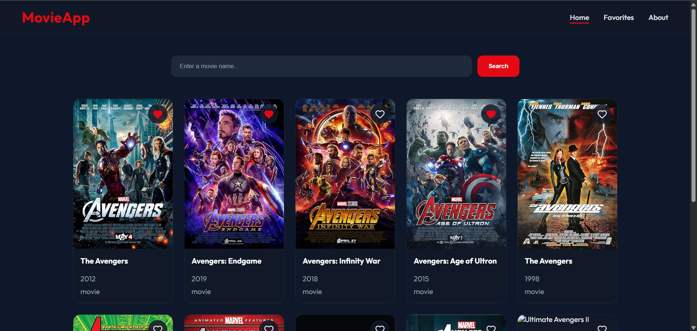
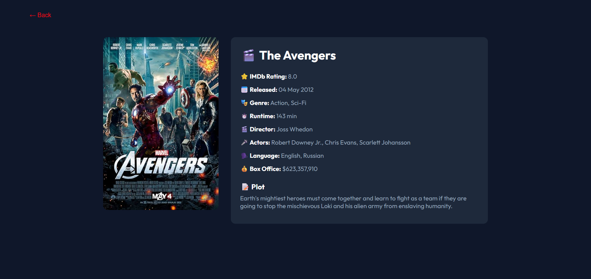
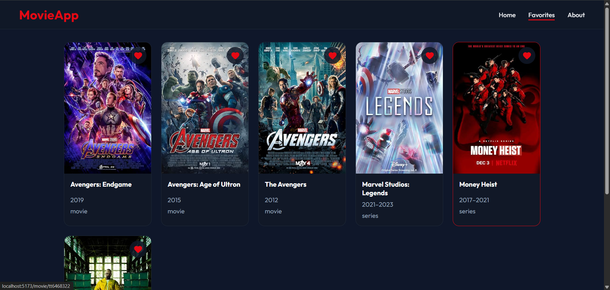
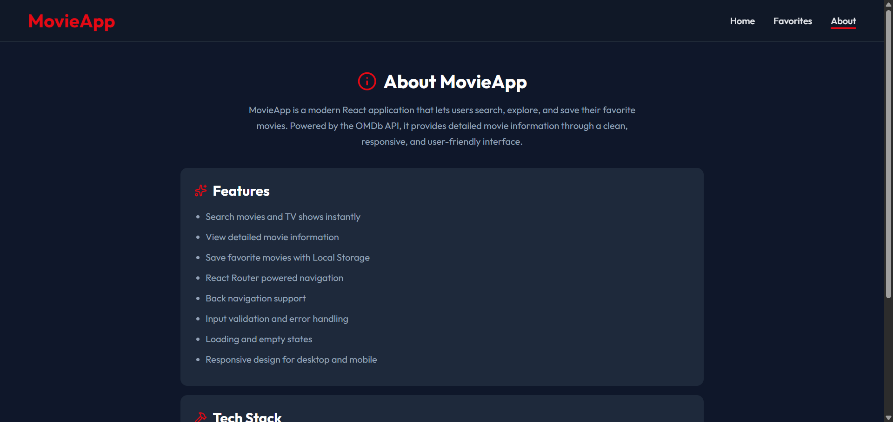

# 🎬 MovieApp

A modern movie search application built with **React** and powered by the **OMDb API**. Search for movies and TV shows, explore detailed information, and save your favorite movies with a clean, responsive user interface.

---

## ✨ Features

- 🔍 Search movies and TV shows
- 🎬 View detailed movie information
- ❤️ Add and remove favorites
- 💾 Favorites persisted using Local Storage
- 🧭 Client-side routing with React Router
- ⬅️ Back navigation support
- ⚠️ Loading, error, and empty states
- 📱 Fully responsive design

---

## 🛠️ Tech Stack

- React
- JavaScript (ES6+)
- React Router
- Vite
- CSS
- OMDb API
- Local Storage

---

## 📸 Screenshots

### Home Page



### Movie Details



### Favorites



### About



---

## ⚙️ Installation

Clone the repository

```bash
git clone https://github.com/yourusername/movie-app.git
```

Navigate to the project folder

```bash
cd movie-app
```

Install dependencies

```bash
npm install
```

Create a `.env` file in the project root and add your OMDb API key:

```env
VITE_OMDB_API_KEY=YOUR_API_KEY
```

Start the development server

```bash
npm run dev
```

---

## 📂 Project Structure

```
src
│
├── components
│   ├── FavoriteCard.jsx
│   ├── MovieCard.jsx
│   ├── Navbar.jsx
│   └── SearchBar.jsx
│
├── pages
│   ├── About.jsx
│   ├── Favorite.jsx
│   ├── Home.jsx
│   └── MovieDetails.jsx
│
├── App.jsx
├── main.jsx
└── App.css
```

---

## 🌐 API

This project uses the **OMDb API** to fetch movie data.

https://www.omdbapi.com/

---

## 📚 What I Learned

Building this project helped me practice:

- React Components
- React Hooks (`useState`, `useEffect`)
- React Router
- API Integration
- Local Storage
- Conditional Rendering
- State Management
- Component Reusability
- Responsive UI Design

---

## 👨‍💻 Author

**Amit Sharma**

Built as a portfolio project to strengthen React fundamentals and modern frontend development skills.
